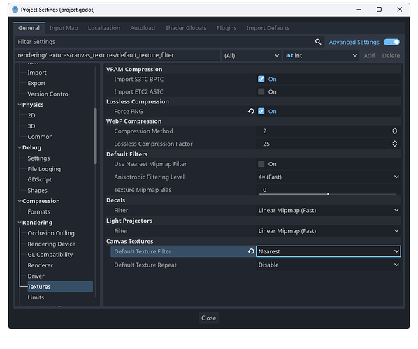

# **Obtenir un Pixel Art net et précis dans Godot**

Pour que ton jeu en Pixel Art sous Godot ait un rendu précis, sans effet de flou sur les pixels, tu dois effectuer les réglages suivants :

1. **Activer les options avancées :**

• Va dans le menu : **Projet → Paramètres du projet**.

• Coche l’option **« Options avancées »** en haut à droite.

2. **Configurer le rendu des textures :**

• Navigue vers l’onglet : **Rendu → Textures** (*Rendering → Textures* en anglais).

• Active l’option **« Compression sans perte → Forcer le PNG »** (*Lossless Compression → Force PNG*).

3. **Régler le filtre des textures :**

• Toujours dans le même onglet, trouve **Textures du Canvas → Filtre par défaut des textures** (*Canvas Textures → Default Texture Filter*).

• Définis cette option sur **« Plus proche »** (*Nearest* en anglais).

[Menu project settings](/Users/lefebvreremy/Library/CloudStorage/Dropbox/octarine/godot_tuto/Godot_tuto/img/crisp_img.png "simple caption")

Grâce à ces réglages, tes images en Pixel Art resteront nettes et parfaitement pixellisées dans ton jeu.

